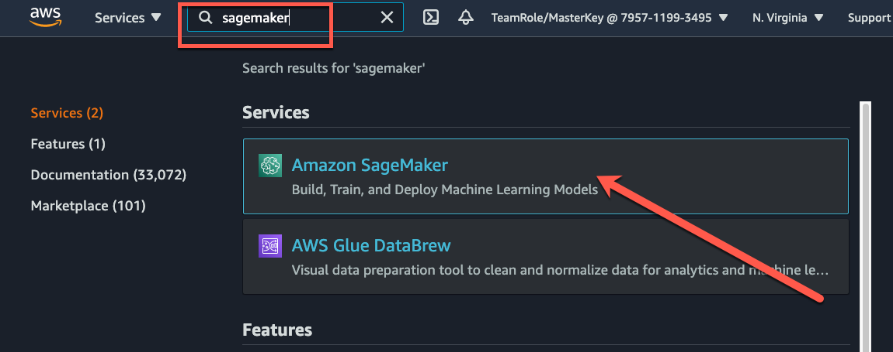

# Amazon Comprehend - a fully-managed AI Service for analyzing text
#### A workshop on document text analysis

# Getting Started

One way to interact with the AWS platform is by using the [AWS Management Console](https://aws.amazon.com/console/). This intuitive, web-based console allows you to administer all of your AWS resources in a single interface.

## Log In
We will be using AWS Event Engine to provide each workshop attendee their own temporary AWS account for the labs so you won't incur any expenses.

An Event Engine Hash (12-digit code) is required to login to Event Engine and start your AWS session.  
The Hash will be provided at the time of the Workshop.

## Browser

We recommend you use the latest version of Chrome or Firefox to complete this workshop. 

We also recommend you open a new Private browser window so there is no conflict with existing AWS cookies. This isn't necessary if you are sure you are logged out of any AWS sessions.

To access the AWS Event Engine Team Dashboard, [open this link in a new tab](https://dashboard.eventengine.run/).

Once the Event has begun, enter the provided 12-digit Event Engine Hash in the Team Dashboard.

Then select OTP (One Time Password). Enter your email address as it was provided to the workshop facilitator (most likely your work email address).

After you receive and enter your OTP, you will be logged in to the Event Engine.

From within the Team Dashboard, click on "AWS Console" and then "Open AWS Console". This will open the AWS console in a new tab for you to begin your labs.

### AWS Account Duration
These lab accounts will be available for you to continue to use for 24 hours after the start of the workshop.

## Verify Region

For this class, we will be doing all of our work out of the **us-east-1 (N. Virgina)** region. To verify you're using the correct region, the region dropdown at the top right of the screen should read _N. Virginia_.

## Next Steps

Now that you're logged in to the console (and have the appropriate region selected!!), let's jump in. If you're new to AWS, we recommend taking a look at the [AWS Overview](overview.md) as a primer.

## Lab 0: Starting Amazon SageMaker Studio

<!--
  
-->

### Beginning the Lab

First we are going to create a SageMaker Studio instance. 

1. From your AWS Console, Type sagemaker in the search bar and then select Select Amazon SageMaker.  
  

2. Next Select **Amazon SageMaker Studio** from the SageMaker Console  
  

3. Select **Quick Start** and then Click the dropdown for **Execution Role**. Here we allow SageMaker to be able to access any S3 buckets we create   
  

4. Select **Create a new role**  

5. Ensure the permissions look like the picture and click **Create Role**  

6. Verify that the Role was creaed successfully and then click **Submit**  

7. Your SageMaker Studio environment is now being created (takes 10-15 minutes)  
  

8. Once the SageMaker Studio environment has been created, click on **Open Studio**  
  

9. Wait until the SageMaker Studio environment has finished loading (5-10 mins)  

??? optional-class "Jupyter notebook instructions (expand for details)"
	- Jupyter notebooks tell a story by combining explanatory text and code. There are two types of "cells" in a notebook:  code cells, and "markdown" cells with explanatory text.  
	- You will be running the code cells.  These are distinguished by having "In" or "[ ]" next to them in the left margin next to the cell, and a greyish background.  Markdown cells lack "In" or "[ ]" and have a blank background.
	- To run a code cell, simply click in it, then either click the **Play** arrow button in the notebook's toolbar, or use Control+Enter on Windows (Shift+Enter on Mac) from your computer's keyboard.  
	- It may take a few seconds to a few minutes for a code cell to run (an asterick will appear in "[ ]" when running and will change to a number once execution has completed).  Please run each code cell in order, and only once, to avoid repeated operations.  For example, running the same training job cell twice might create two training jobs, possibly exceeding your service limits.

